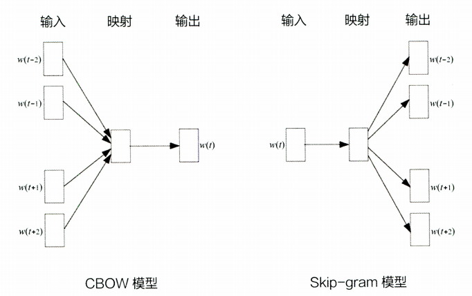
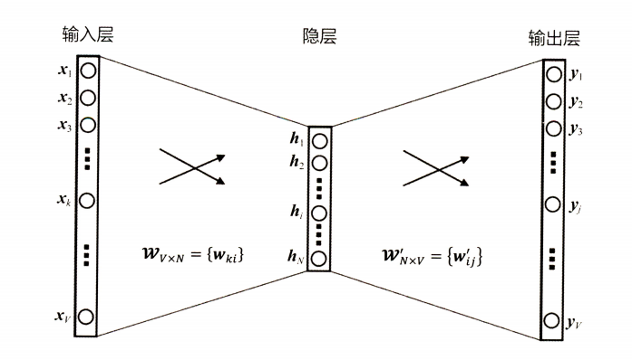
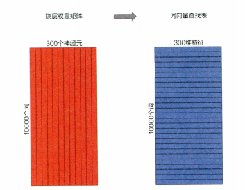
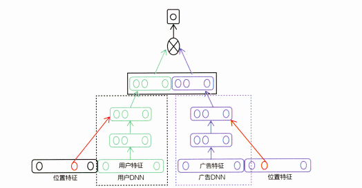
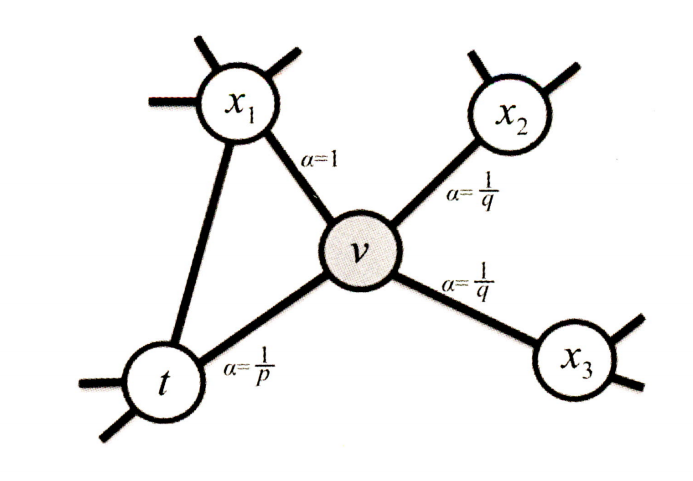
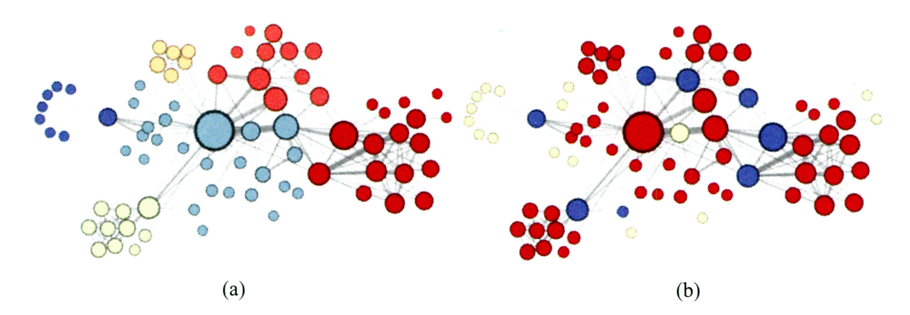
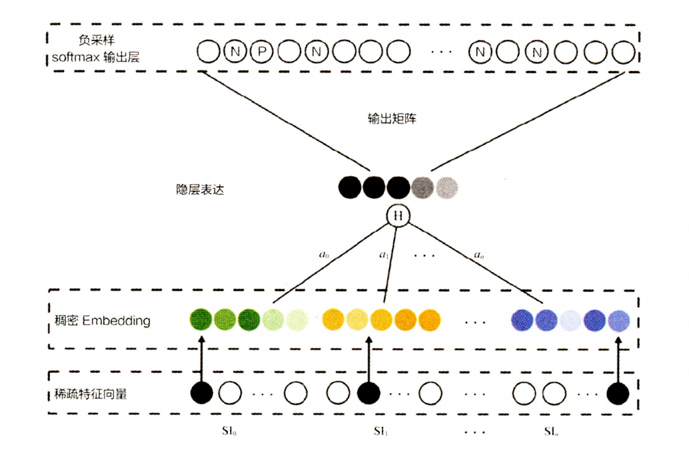
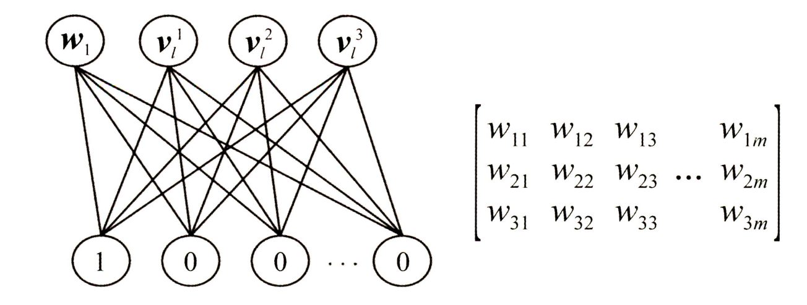
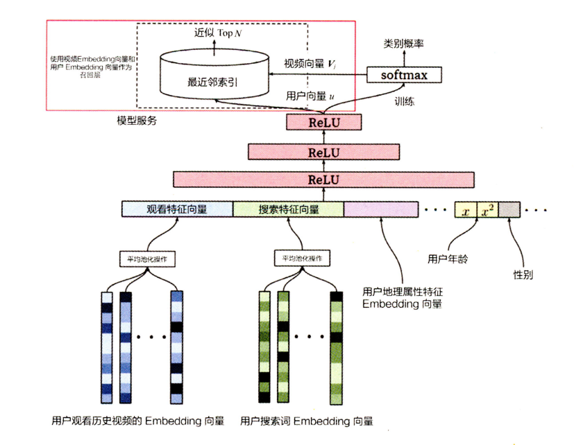

# Embedding in Recommendation

## 1.Embedding基础知识

### 1.1 Embedding含义

##### Embedding就是用一个低维度稠密的向量”表示“一个对象（一个词，一个商品id等），这里”表示“的含义可以理解为将原来的对象映射为其特征的表示，也就是说任何一个对象都可以使用一定维度的特征进行描述。

### 1.2 Embedding技术对于深度学习推荐系统的重要性

##### Embedding对于深度学习推荐系统的帮助主要有以下几点：（1）推荐系统中常常使用one-hot编码对类别、id类型特征进行编码，导致样本特征向量极其稀疏，而深度学习的结构特点使其不利于稀疏特征向量的处理，因此几乎所有深度学习推荐模型都会使用Embedding技术进行数据映射；（2）Embedding本身就是极其重要的特征向量，其与MF相比所产生的特征向量的表达能力更强，特别是图Embedding技术提出以后，Embedding技术几乎可以对所有信息进行编码，使得其本身就包含大量的有价值的信息；（3）Embedding对物品、用户相似度的计算是常用的推荐系统召回技术，在局部敏感哈希等快速最近邻搜索技术应用于推荐系统后，Embedding更适用于对海量备选物品进行快速筛选，过滤出一部分商品用于精排

## 2. Embedding应用经典案例

### 2.1 Word2vec

##### Word2vec不仅让词向量在自然语言处理领域再度流行，还让Embedding技术从自然语言处理领域推广到推荐、图像等领域，成为深度学习不可或缺的技术。Word2vec其含义就是将词转换为对应的向量表示，给定一个语句表示，其由T个词组成，假定每个词都与其相邻的词的关系最密切，也即每个词都是由相邻的词决定（CBOW模型），或者每个词都决定了其相邻的其他词（Skip-gram模型），两种方法如下图所示：

##### Word2vec的训练过程由以下几个部分组成：（1）构造训练样本（一般使用滑动窗口将一个句子划分为多个子句用于训练）；（2）定义优化目标（这里表示的是第二种模型），因为每个词都决定了其相邻的几个词语，可以使用极大似然估计的方法，希望所有样本的条件概率之积最大。其优化目标表示为：

$$
\frac{1}{T}\sum^{T}\limits_{t=1}\sum\limits_{-c\le j\le c,j\neq 0}\log p(w_{t+j}|w_{t})
$$

##### 其核心在于如何定义后面的条件概率，作为一个多分类问题，最直接的方法是使用softmax函数。Word2vec的目标是希望一个词向量表示一个词，使用词之间的内积距离表示语义的接近程度，那么条件概率的定义可以使用下式进行表示：

$$
p(W_{O}|W_{I})=\frac{\exp(V^{'T}_{W_{O}}V_{W_{I}})}{\sum^{W}\limits_{W= 1}\exp(V^{'T}_{W}V_{W_{I}})}
$$

$$
W_{O}表示输出词,W_{I}表示输入词
$$

##### 在Word2vec中使用一个词预测其相邻的词，但其实两者的向量表达并不在一个向量空间中，其使用的是词的输入向量表达与输出向量表达。根据条件概率的定义，可以把两个向量的乘积再套上一个softmax的形式，转换成如下图所示的神经网络结构。Word2vec的模型结构如下图所示（有点类似于自编码器）：

##### 在获得输入向量矩阵之后，其中每一行对应的权重向量就是通常意义上的”词向量“。于是这个权重矩阵自然转换成了Word2vec的查找表。其结构如下图所示：

##### 当输入词数目较大的时候（万级别以上），直接使用预测误差进行迭代会导致计算的代价过于庞大，在实际计算中也无法承受这样巨大的计算量。为了减轻Word2vec的训练负担，往往应用负采样方法进行训练。这里只需要对负采样出来的一部分数据计算预测误差，极大地减轻了计算开销。在引入负采样之后，Word2vec的多分类问题就转换为近似二分类问题，其目标函数如下所示：

$$
E=-\log\sigma(V^{'T}_{W_{o}}h)-\sum\limits_{w_{j}\in W_{neg}}\log\sigma(-V^{'T}_{W_{j}}h)
$$

$$
其中V^{'}_{W_{o}}表示输出词向量(正样本),h表示隐层向量,W_{neg}是负样本集合,V^{'}_{W_{j}}表示负样本词向量
$$

##### 由于负样本集合的大小Neg非常有限，在每轮梯度下降的迭代中，计算复杂度至少可以缩小为原来的Neg/C，另外加快Word2vec的训练速度的方法，还有层级softmax，但实现较为复杂

##### Word2vec有一个最基础的缺点，就是其没有考虑单词的上下文信息（相同单词在不同语句或者上下文中有不同的语义表示），其对于不同语句中同一个词语产生的embedding是一样的，因此其不能有效地处理依赖于上下文的词语的表示。另外其仅仅能够针对词序列样本进行训练

#### Tips：常用的负采样技术

##### （1）随机负采样，又叫均匀负采样，从所有词中随机采样一部分词用于计算预测误差；（2）流行度负采样，将所有词中出现最多的词作为负样本计算预测误差；（3）相似性负采样，计算不同词之间的相似度（可以是Embedding相似度，可以是共现次数，还可以是否属于同一类别（词性、聚类等））；（4）使用模型来生成一些负样本（对抗生成或者元学习构造）

##### Word2vec的意义：其使得词向量在业界迅速推广，使得Embedding这一研究话题成为热点；另外其提出的模型结构、目标函数、负采样方法以及负采样中的目标函数，在后续其他模型中不断迭代和优化

### 2.2 Item2vec

##### Item2vec基本原理：其使用Embedding方法对物品进行编码，而用户的Embedding表示直接使用物品Embedding的平均或者聚类进行表示；可以直接在推荐系统的召回层中使用Embedding计算相似度得到一个相似性候选集合，或也可直接用于排序层直接用于最后推荐列表的排序。其输入为用户的历史行为序列，目标函数如下所示：

$$
\frac{1}{K}\sum^{K}\limits_{i=1}\sum^{K}\limits_{j\neq i}\log p(w_{j}|w_{i})
$$

##### Item2vec抛弃了时间窗口的概念，认为序列中任意两个物品都相关，因此在Word2vec的目标函数中可以看出，其是两两物品的对数概率的和，而不仅仅是时间窗口内物品的对数概率之和。除了目标函数，其训练过程和最终物品的Embedding产生过程与Word2vec完全一致，最终物品向量的查找表就是Word2vec中词向量的查找表

#### 2.2.1 广义Item2vec

##### 使用Embedding技术对物品进行向量化的技术不止Word2vec一种，广义来说，任何一种能够生成物品向量的方法都可以称之为Item2vec，最典型的一个应用就是双塔模型，其模型结构如下图所属：

##### 上图所示的双塔模型（”用户塔“和”物品塔“）中，广告侧的模型结构实现的其实就是对物品进行Embedding的过程。”物品塔“起到的作用的本质是接收物品相关的特征向量。经过物品塔内的多层神经网络结构，最终生成一个多维稠密向量（从Embedding角度出发，其就是物品的Embedding向量）。不论模型的结构多么复杂，或者数据输入测的特征多么多样，其最终目的就是把物品的原始特征转换为稠密的物品Embedding向量表达。因此可以将此类模型称之为”广义“的Item2vec模型

#### 2.2.2 Item2vec方法的特点与局限性

##### 其特点是泛化能力强，可以利用任何序列数据生成物品的Embedding向量，其大大拓展了Word2vec的应用场景；其局限性在于只能利用序列类型的数据

### 2.3 Graph Embedding

##### 因为Word2vec和Item2vec只适用于序列类型的数据，但是实际应用场景中还有其他类型的数据，例如图结构类型的数据，就无法使用上述方法生成合适的Embedding表示，常见的图结构如下所示：

##### Graph Embedding是一种针对图结构中的节点进行Embedding编码的方法，最终生成的节点Embedding向量一般包含图的结构信息以及附近节点的局部相似性信息

#### 2.3.1 DeepWalk

##### DeepWalk的思想主要是在物品构成组成的图上进行随机游走，产生大量的物品序列，然后将这些物品序列作为训练样本输入Word2vec进行训练，得到物品的Embedding。其可以看作是从序列Embedding到图Embedding的过度，其算法流程如下所示：

##### DeepWalk的算法流程为：（1）首先输入为原始的用户行为序列；（2）基于这些输入行为序列进行构图（按照有向边进行构图）；（3）然后使用随机游走的方式随机选择起始点，重新生成物品序列；（4）将重新生成的序列表示放进Word2vec模型中，生成最终的物品Embedding向量。其核心在于随机游走重新构建序列的过程，其主要是需要定义在到达某一点之后，下一步遍历当前点的邻接点的概率（就是跳转边的权重所占所有相关出边权重之和的比例）；假设物品关系图为一个有向有权图（如果是无向无权图，取跳转概率计算中边的权重都为1），那么从当前节点跳到下一个节点的概率为：

$$
p(v_{j}|v_{i})=\left\{\begin{array}{**lr**}\frac{M_{ij}}{\sum\limits_{j\in N_{+}(v_{i})}M_{ij}}&,v_{j}\in N_{+}(v_{i}) \\ 0&,e_{ij}\notin \epsilon \end{array}\right.
$$

$$
\epsilon表示所有边的集合,N_{+}(v_{i})是节点v_{i}的所有出边集合,M_{ij}是v_{i}到v_{j}边的权重
$$

##### DeepWalk在Graph Embedding中易于实现和使用，但是随机游走的针对性不强

#### 2.3.2 Node2vec

##### Node2vec在DeepWalk的基础上对随机游走权重的方法进行了调整，使得其获得的Embedding更倾向于体现网络的同质性或结构性；网络的同质性是指距离相近的节点的Embedding表示应该尽量相似；网络的结构性是指结构上相似的节点的Embedding表示应该尽量相似。为了使得Embedding的结果能够表达网络的结构性，在随机游走的过程中，需要让游走的过程更倾向于BFS，因为BFS会更多地在当前节点的邻域中进行游走遍历，相当于对当前节点周边的网络结构进行一次“微观扫描”。当前节点类型（“边缘节点”、“连接性节点”，“局部中心节点”）不同，其生成的序列包含的节点数量和顺序必然是不同的，从而使得最终的Embedding表示抓取更多的结构性信息。另外，为了表达同质性，需要让随机游走的过程更倾向于DFS，因为DFS更有可能通过多次跳转，游走到更远的节点上。使用该方式的游走更大概率会在一个大的集团内部进行，这就使得一个集团或者社区内部的节点的Embedding更为相似，从而表达网络的同质性。这里其跳转概率计算方法如下：

##### 从节点v跳转到下一个节点x的概率可以使用下列公式进行计算：

$$
\pi_{vx}=\alpha_{pq}(t,x)\cdot\omega_{vx}
$$

$$
\alpha_{pq}(t,x)=\left\{\begin{array}{**lr**}\frac{1}{p}&, d_{tx}=0\\ 1&,d_{tx}=1\\ \frac{1}{q}&,d_{tx}=2 \end{array}\right.
$$

$$
\omega_{vx}表示边vx的权重,d_{tx}表示节点t到节点x的距离,参数p和q共同控制随机游走的倾向性
$$

##### 其中参数p称之为返回参数，其值越小，随机游走回节点t的可能性越大，Node2vec就更注重于网络的结构性；参数q称之为进出参数，q越小，随机游走到更远节点的概率就越大，Node2vec就更加注重于同质性，反之则节点更可能在附件节点游走；其灵活表达同质性和结构性的特点在实验中得到了证实，通过调整参数p和q产生了不同的Embedding结果，可以得到下列两种结果，从下图可以看出，左图中距离相近的点更加靠近（更加注重于同质性）；右图中结构相似的点更加靠近（更加注重于结构性）

##### Node2vec中网络的同质性和结构性在推荐领域可以被很直观的解释。同质性可以是相似的物品（同类别、同属性、经常一起被购买）；结构性可以是属于某一个大类的物品（爆款、最佳拼单商品等）。可以将不同Node2vec生成的偏向结构性和偏向同质性的Embedding结构一起输入到后续的深度神经网络中，用以保留物品的不同图信息

##### Node2vec可以有针对性的挖掘不同的网络特征，但是其需要较多的人工调参工作

#### 2.3.3 EGES

##### 其思想是在DeepWalk基础之上引入补充信息，单单利用用户历史行为生成的物品相关图，在面对冷启动问题或者长尾分布的数据时候则会表现出较差的结果。为了缓解上述问题，一种最直观的解决方式就是引入补充信息（商品属性信息等）来丰富Embedding信息的来源，从而使得没有历史行为记录的商品获得合理的Embedding表示。生成Graph Embedding的第一步在于生成物品关系图，通过用户行为序列可以构建物品关系图，也可以使用其他信息，例如属性，类别等信息生成基于内容的知识图谱。可以使用其他的属性或者类别信息构建不同的关系图，用于生成补充信息Embedding向量

##### 使用多个信息的关键在于如何对这些信息进行有效地融合。最简单的方法是在深度学习神经网络中加入平均池化层，将不同的Embedding平均起来，为了防止简单的平均池化操作导致信息的流失，可以对每一个特征对应的Embedding向量赋予一个不同的权重，该权重可以使用将平均池化之后的Embedding表示输入一个softmax获得(最后可以根据实际需要对所求权重进行缩放)，通过梯度反向梯度传播求得，其模型如下图所示：

##### EGES其给出了一个如何融合多种特征的解决方案，降低了某类信息缺失造成的了冷启动问题，另外其融合多种补充信息，解决Embedding的冷启动问题；但是没有较大的学术创新，更多是从工程角度解决多Embedding融合的问题

## 3. Embedding与深度学习推荐模型的结合

##### Embedding技术在推荐领域主要应用在以下几个方面：（1）在深度学习网络中作为Embedding层，完成从高维稀疏特征向量到低维稠密特征向量的转换；（2）作为预训练的Embedding特征向量，与其他特征向量连接过后，一同输入神经网络进行训练；（3）通过计算用户和物品的Embedding相似度，Embedding是可以直接应用于推荐系统的召回和排序

### 3.1 使用Embedding层进行向量转换

##### 高维稀疏特征向量天然不适合多层复杂神经网络的训练，因此如果使用深度学习模型处理高维稀疏特征向量，几乎都会使用Emdedding进行向量转换；在深度神经网络中Embedding层是一个高维向量转向低维向量的直接映射。用矩阵表达Embedding层，本质是求解一个m（输入维度）xn（输出维度）维的权重矩阵的过程。其图示和矩阵表达如下图所示：

##### 将Embedding与整个神经网络整合之后一同进行训练是理论上最优的选择，因为上层梯度可以直接传递到输入层，模型整体是自洽的。这样做的缺点就是Embedding输入向量的维度往往很大，导致整个Embedding层的参数数量巨大，因此Embedding层的加入会拖慢整个神经网络的训练速度，为了缓解这一问题，引入了预训练的方法来进行缓解

### 3.2 Embedding的预训练方法

##### Embedding预训练主要是独立于神经网络进行训练，最典型的模型是FNN模型，其使用FM模型训练所得的各特征的隐向量作为Embedding层的初始化权重，从而加快整个模型的收敛速度；整个FNN的反向传播过程中还是会更新Embedding的参数，如果需要进一步加快收敛速度，可以固定Embedding层的参数，只是训练神经网络部分的参数。可以利用GBDT完成Embedding预训练，然后将其用于单层神经网络进行CTR预估

### 3.3 Embedding用作推荐系统的召回层

##### Embedding中包含了物品和用户的潜在信息，因此可以直接用于推荐模型的召回，YouTube推荐系统召回层模型结构如下图所示：

##### 该模型的输出层为softmax函数（用于多分类任务），其预测目标是用户观看了那个视频，其输入是经过三个ReLu激活函数的Embedding表示，输出向量是用户观看每一个视频的概率分布。这里不需要进行在线计算和更新，只需要将离线训练好的视频Embedding表示和用户Embedding表示上线做内积计算相似性得分，排序之后直接用于召回即可，但是在面对百万级别的Embedding向量的内积运算操作，任然是很慢的，可以使用局部敏感哈希的方法进行快速召回

### 3.4 局部敏感哈希

##### 假设Embedding空间维度为k，物品总数为你，正常情况下需要O(kn)的时间复杂度用于遍历计算用户和物品的向量相似度，这在现实场景中是不太适用的（现实生活中n的数量级动辄百万级别）。换一个思路，在向量空间中对具有相似的Embedding的向量进行召回，也就是在向量空间中搜索最近邻的过程。这里可以通过构建kd树索引结构进行最近邻搜索，其时间复杂度可以降低到log级别，但是其实现结构较为复杂，在进行最近邻搜索过程中往往需要回溯，确保最近邻的结果，导致搜索过程较为复杂；另外其log级别的时间复杂度任然巨大，可以使用局部敏感哈希的办法进行Embedding最近邻的快速搜索

##### 局部敏感哈希的基本思想是让相邻的点落入同一个“桶”，这样在后续搜索过程中仅需要搜索一个桶内的数据即可，如果保证每一个桶内的数据在一个常数附件，就可以把最近邻搜索的时间复杂度降低到常熟级别。在欧氏空间中，将高维空间的点映射到低维空间中，原本相近的点在低维空间中依然相近，但原本远离的点有一定概率变为相近的点，利用低维空间可以保留高维空间相近距离关系的性质，就可以构造局部敏感哈希桶。对于Embedding向量来说，也可以使用内积操作来构建局部哈希桶，假设v是高维空间中的k维Embedding向量，x是随机生成的k维映射向量，通过内积操作可以将v映射到一维空间中，成为一个数值：

$$
h(v)=v\cdot x
$$

##### 使用哈希函数进行分桶操作：

$$
h^{x,b}(v)=\lfloor \frac{v\cdot x+b}{w} \rfloor
$$

$$
\lfloor \rfloor表示向下取整,w是分桶宽度,b\in [0,w],用于避免分桶固定化
$$

##### 映射操作损失了部分距离信息，如果仅仅采用一个哈希函数进行分桶，其必然存在相邻点误判的情况。有效的解决办法是采用多个哈希函数同时进行分桶，同时掉进m个哈希函数的同一个桶的两点，使得相似概率大大增加。通过分桶找到相邻点的候选集合后，就可以在有限的候选集合中通过遍历找到目标点真正的K近邻

##### 采用多个哈希函数进行分桶，存在一个有待解决的问题，最后生成的候选集是用并集还是交集操作，如果使用交集，则表明属于K近邻的两点在所有哈希函数的分桶中都属于同一个桶（该方法所寻找的近邻更加准确，但是无疑会遗漏一些近邻点）；采用并集，则表明属于K近邻的两点在任何一个哈希函数的分桶中趋于同一个桶即可满足K近邻（该方法使得寻找最近邻中召回效率较高，但候选集规模仍有可能巨大，导致计算开销上升）。这里除了点积计算相似度，余弦相似度还有多种计算方式，参看：[相似度计算方式](https://github.com/QinHsiu/Trick/tree/main/similarity_distance)

##### 局部敏感哈希解决利用Embedding推荐系统召回层的快速计算问题，其存在小概率的最近邻遗漏的问题，需要进行较多的人工调参

