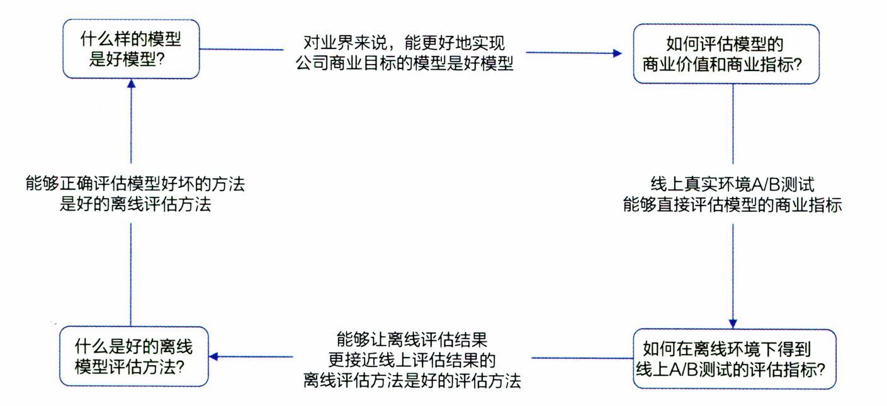
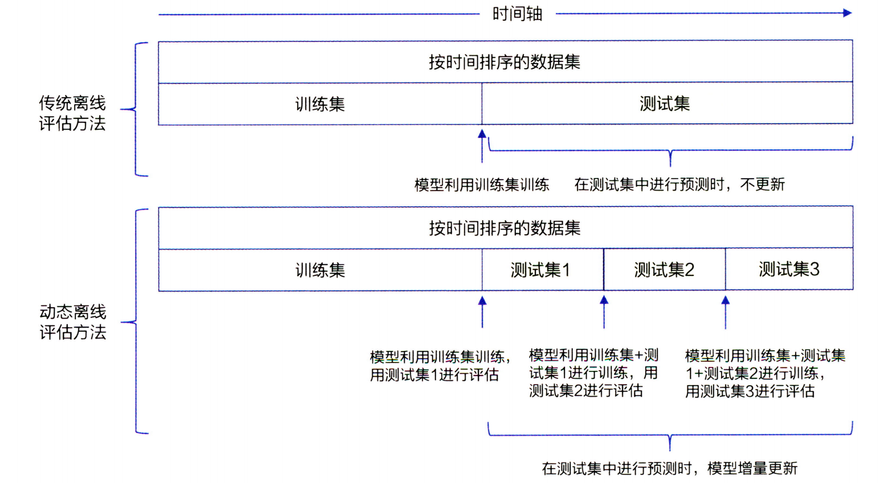
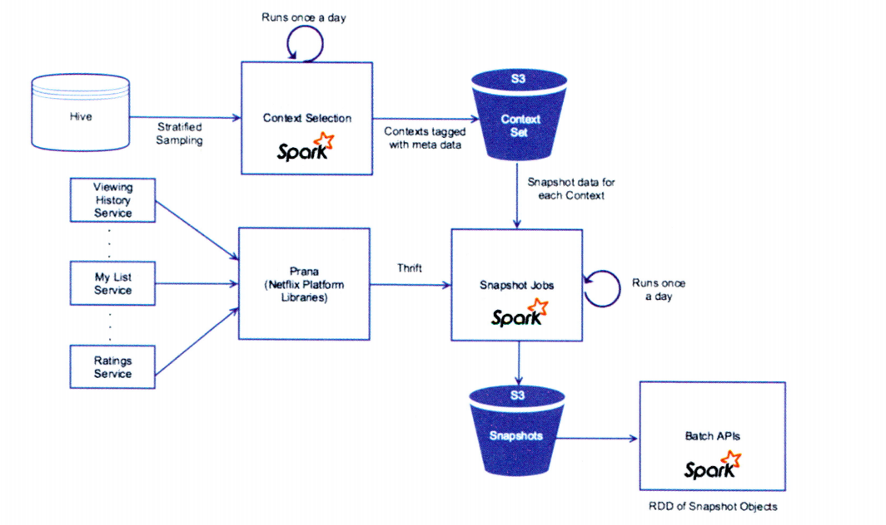
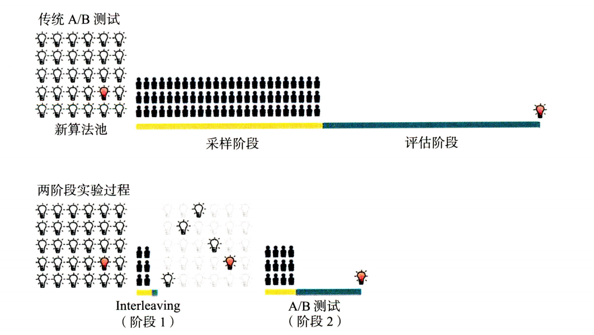
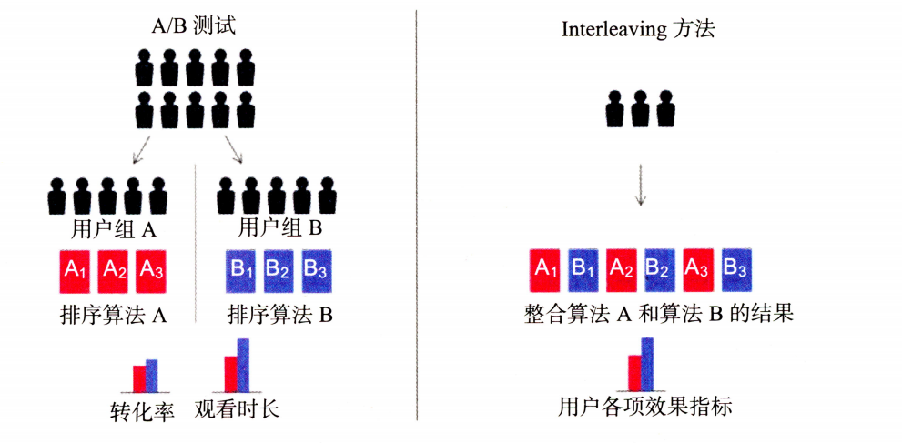
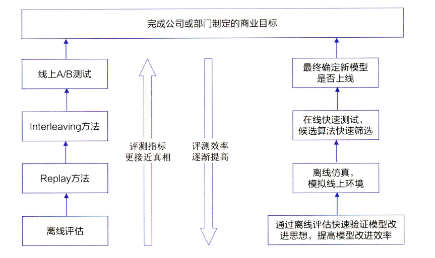

# Others

## 1. 推荐系统的评估

###### （1）推荐系统评估所采用的指标直接决定了推荐系统的优化方向是否符合客观实际

##### （2）推荐系统评估是机器学习团队与其他团队沟通合作的接口性工作

##### （3）推荐系统的评估指标的选取直接决定了推荐系统是否符合公司的商业目标和发展愿景

### 1.1 离线评估方法与指标

#### 1.1.1 离线评估的主要方法

###### Holdout检验：其将原始的样本集合随机划分为训练集与验证集两部分。其缺点是在验证集上计算出来的评估指标与训练集和验证集的划分有直接关系，其结果因为划分数据集的方法存在较大的随机性

##### k折交叉检验：先将全部样本划分为k个大小相等的样本子集，依次遍历这k个子集，每次把当前子集作为验证集，其余所有子集作为训练集，进行模型的训练与评估，最后将所有k次的评估指标的平均值作为最终评估指标

##### 留一验证：每次留下一个样本作为验证集，1其余所有样本作为训练集。样本总数为n，依次遍历所有n个样本，进行n次验证，再将评估指标求平均得到最终指标。在样本数目较多的情况下，其开销较大

##### 自助法：基于自助采样的检验方法，对于总数为n的样本集合，进行n次有放回的随机抽样，得到大小为n的训练集。在n次采样过程中，有的样本会被重复采样，有的样本不会被采集到，将没有被选中的样本作为验证集

#### 1.1.2 离线评估指标

##### 准确率：分类准确的样本数占据所有样本数的比例

##### 精确率与召回率：精确率是指分类正确的样本占据分类器判定为正样本的样本个数的比例；召回率是指分类正确的样本数目占真正的正样本的数目的比例

##### 精确率与召回率是矛盾统一的两个指标，为了提高精确率，分类器需要尽量在更高精度的情况下将样本预测为正样本，但往往会因为过于要求精度而漏掉很多正样本，导致召回率较低

##### F1-score:其是精确率与召回率的调和平均值

##### 均方根误差：其经常被用来衡量回归模型的好坏，正常情况下，其能够反映回归模型预测值与真实值的偏离程度，但是其不擅于处理存在离群点的数据，即使离群点数据非常少，也会使得均方根误差变得很差

##### 平均绝对误差：其相对于均方根误差对于每一个点的误差进行了归一化，降低了个别离群点带来的绝对误差的影响

##### 对数损失函数：对数损失函数经常用于离线评估，其就是逻辑回归的损失函数，大多数模型的最后一层都需要经过softmax，因此采用对数损失函数作为评估指标能够非常直观的反映模型损失函数的变化

##### P-R曲线：P-R曲线的横轴是召回率，纵轴是精确率。对于一个排序模型来说，其P-R曲线上的一个点代表“在某一个阈值下面，模型将大于该阈值的结果判定为正样本，将小于该阈值的结果判定为负样本时，排序结果对用的召回率与精确率”。在绘制好P-R曲线后，计算曲线下的面积能够量化P-R曲线的优劣。AUC指的是P-R曲线下的面积大小。AUC越大，排序模型效果越好

##### ROC曲线：其横坐标为假阳率，纵坐标为真阳率。ROC曲线定义较为复杂，其与P-R曲线一样也是通过不断移动模型正样本阈值生成的。

##### 平均精度均值：其对平均精度的再次平均。平均精度是指根据正样本的精确度进行平均，如果是对所有用户在求一次平均就是平均精度均值

##### 其他评估指标： 归一化折损累计增益、覆盖率、多样性等，常用的评估指标参看：[link](https://github.com/QinHsiu/Trick/tree/main/evaluation_metric)

### 1.2 离线评估仿真方法

##### 离线评估的重点是让离线评估指标的结果最终能够尽量接近线上结果。离线评估的逻辑闭环如下所示：

#### 1.2.1 动态离线评估方法

##### 动态离线评估方法先根据样本产生时间对测试样本由早到晚进行排序，再用模型根据样本时间依次进行预测。在模型更新的时间点上，模型需要增量学习更新时间点前的测试样本，更新后继续进行后续的评估。两者的对比如下图所示：

##### Netflix的Replay评估方法-时光机

##### 从上图可以看出，该方法是以天为单位进行启动的，其主任务的主要功能是把当天的各类日志、特征、数据整合起来，形成当天的供给模型训练和评估所使用的样本数据

### 1.3 线上A/B测试方法和线上评估

##### A/B测试又叫分流测试与分桶测试，是一个随机实验，通常被分为实验组和对照组。在利用控制变量法保持单一变量的前提之下，将A、B两组数据进行对比，得出实验结论。A/B测试的主要核心点包括：

- ##### 离线评估无法完全消除数据有偏现象的影响，因此得出的离线评估结果无法完全代替线上评估结果

- ##### 离线评估无法完全还原线上的工程环境，离线评估没有考虑线上环境的延迟、数据丢失、标签数据缺失等情况，因此离线评估环境只能说是理想状态下的工程环境，其得出的结果存在一定的失真现象

- ##### 线上系统的某些商业指标在离线评估中无法计算。离线评估一般针对模型本身进行评估，无法直接获得与模型相关的其他指标，特别是商业指标。线上评估可以全面了解该模型的用户点击率、留存时长、PV访问量等的变化

##### A/B测试的分桶原则：在A/B测试的分桶过程中需要注意的是样本的独立性与采样方式的无偏性：同一个用户在测试的全过程中只能被分到同一个桶中，在分桶过程中所用的用户ID应该是一个随机数，这样才能保证桶中的样本是无偏的

##### A/B测试分层与分流的机制：（1）层与层之间的流量正交，层与层之间的独立实验的流量是正交的，即实验中每一组的流量穿越该层之后，都会被再次随机打散，且均匀地分布在下层实验的每一个实验组中；（2）同层之间的流量互斥，一方面如果同层之间进行多组的A/B测试，那么不同测试之间的流量是不重叠的，另外一方面一组A/B测试中实验组和对照组的流量不是重叠的，是互斥的。互斥的含义是不同实验之间的用户应该是不重叠的

##### 线上A/B测试的评估指标如下所示：

### 1.4 快速线上评估测试方法

##### Interleving是一种快速线上评估方法，其从大量的初始想法中筛选出少量优秀的推荐算法，再对缩小的算法集合进行传统的A/B测试，用以测量它们对用户行为的长期影响，使用该方法进行快速线上测试的示意图：

##### 在互联网中，非常活跃的用户往往是少数，但其贡献量（浏览网页、观看影视）却占比较大，因此在做A/B测试的时候忽略这些隐藏信息，可能会导致两者结果差异较大。解决的办法就是不对人群进行划分，也即不区分A/B组，而是把所有的测试对象看作一个整体，然后将被测对象同时展现给受试者（测试对象），最后根据受试者偏好得出评估结果。传统A/B测试与Interleving的比较如下所示：

##### 在使用该方法的时候需要考虑位置偏差的存在，避免来自算法A的结果总是排在第一个位置，需要对排序结果进行整合。在验证该方法的有效性需要从两个方面考虑：灵敏度和正确性。灵敏度是指判断该方法较传统A/B测试方法需要多少样本就能够判断出不同算法的好坏（考虑到线上资源有限的原因，当然是需要越少的样本越好）；正确性是指该方法的判断结果是否与A/B测试的结果一致。

##### 该方法的优点：所需要的样本数目少，测试速度快，结果与传统A/B测试的结果无明显差异；

##### 该方法的局限性：（1）工程实现的框架较于传统A/B测试更加复杂，其逻辑可能会对业务逻辑产生干扰，并且需要大量的辅助性数据标识，工程实现难度较大；（2）其只是对”用户对算法推荐结果偏好程度“的相对测量，并不能得出一个算法的真实表现，无法知道不同算法具体的效果

##### 推荐系统的评估体系如下所示：

